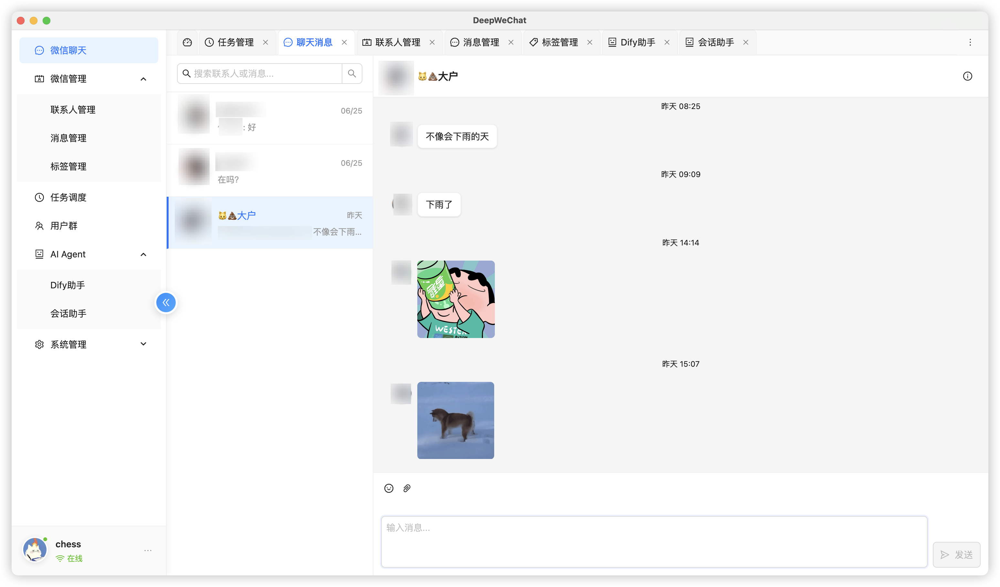
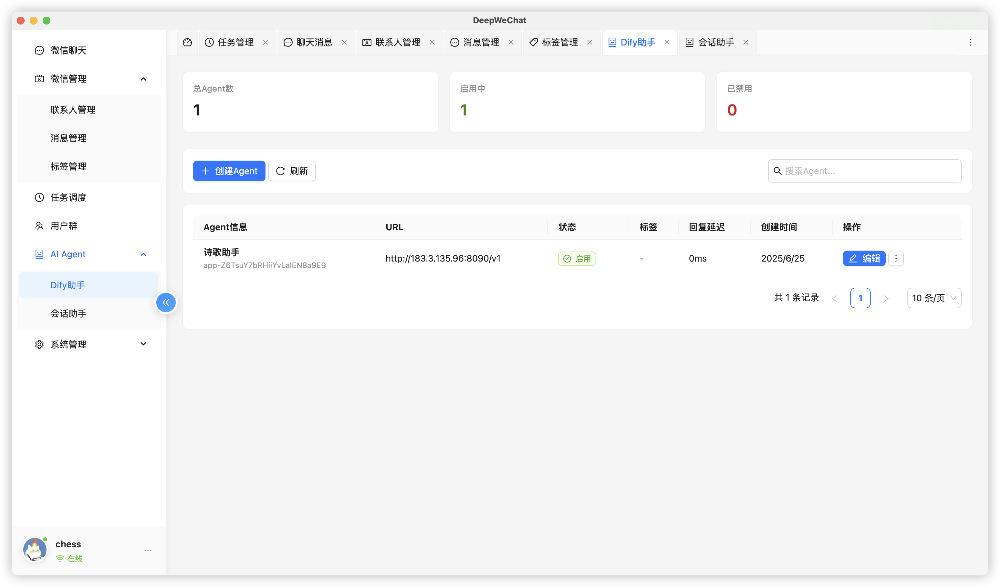
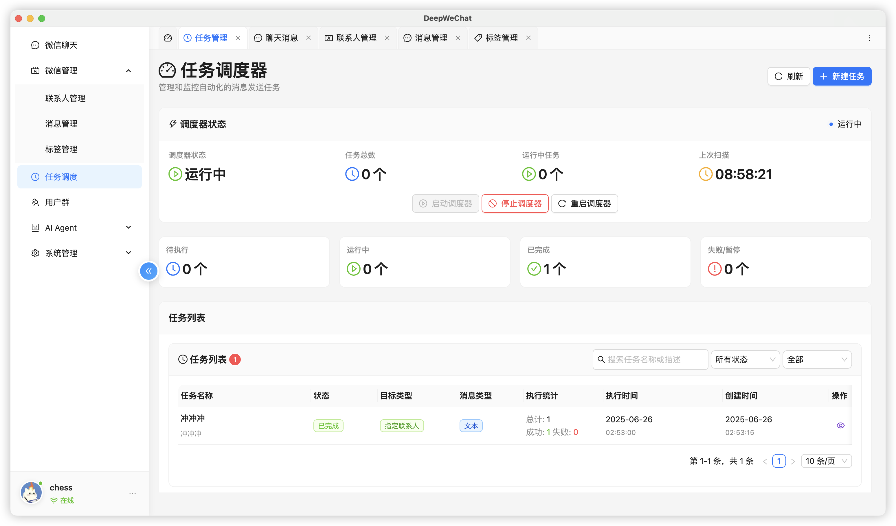
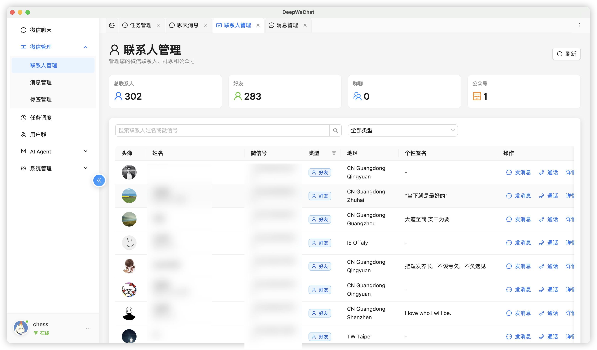
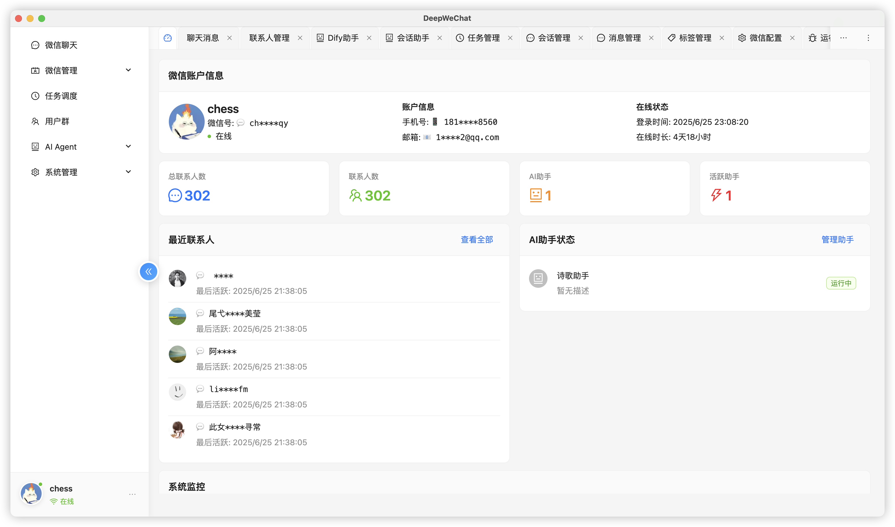

# 天玑微信AI - AI赋能的智能微信解决方案



## 🌟 产品概述

**天玑微信AI**是一个由AI驱动的智能微信通讯解决方案，专为现代企业的微信运营需求而设计。平台将强大的AI能力深度集成到微信中，通过智能对话、自动化任务调度和数据分析，帮助企业实现微信客户服务和营销的全面智能化升级。

### 🎯 核心价值主张 - 两大特色功能

#### 🤖 特色功能一：微信AI智能引擎
- **AI驱动的智能对话**：7×24小时AI助手，基于大语言模型提供专业级客服
- **智能情感识别**：AI自动识别客户情绪和意图，提供个性化回复策略
- **知识库智能问答**：接入企业知识库，AI提供专业领域的精准回答
- **多轮对话记忆**：AI具备完整上下文记忆，支持复杂业务场景对话

#### 📊 特色功能二：智能任务推送系统
- **用户标签智能分析**：基于客户行为、偏好、购买历史等数据自动打标签
- **精准营销推送**：根据用户标签智能匹配营销内容，实现千人千面
- **最佳时机预测**：AI分析用户活跃时间，选择最佳推送时机提升转化率
- **效果实时优化**：AI监控推送效果，自动调整策略优化营销ROI

---

## 🚀 两大特色功能深度解析

### 🤖 特色功能一：微信AI智能引擎



#### 💬 AI智能对话核心能力
- **大语言模型集成**：深度集成Dify AI平台，支持GPT-4、Claude、文心一言等主流大模型
- **智能情感分析**：实时分析客户情绪状态，提供情感化、个性化的回复策略
- **企业知识库问答**：无缝接入企业专属知识库，AI提供专业领域的精准回答
- **多轮对话记忆**：AI具备完整的对话上下文记忆，支持复杂业务场景的连续对话

#### 🎯 智能路由与协作系统
- **语义理解触发**：基于AI的深度语义理解，精准识别客户意图和触发场景
- **智能助手路由**：自动分析客户需求，路由到最合适的专业AI助手
- **多助手协同**：支持销售、客服、技术等不同专业领域的AI助手协同工作
- **人机智能协作**：AI无法处理的复杂问题智能转接人工，确保服务质量

#### 🔧 微信深度整合
```typescript
// AI智能回复
await tianji.ai.smartReply(message, {
  context: conversationHistory,
  knowledge: enterpriseKB,
  personality: 'professional'
});

// 智能好友管理
await tianji.ai.manageFriends({
  autoWelcome: true,        // 自动欢迎新好友
  smartClassification: true, // 智能分类好友
  behaviorAnalysis: true    // 行为分析
});

// 智能朋友圈互动
await tianji.ai.manageMoments({
  autoLike: true,           // 智能点赞
  smartComment: true,       // 智能评论
  contentAnalysis: true     // 内容分析
});
```

### 📊 特色功能二：智能任务推送系统



#### 🏷️ 用户标签智能分析引擎
- **多维度标签体系**：基于客户行为、购买历史、互动偏好、消费能力等维度自动打标签
- **动态标签更新**：AI实时分析客户行为变化，动态更新用户标签确保精准度
- **标签组合策略**：支持多标签组合筛选，实现精细化客户分群
- **预测性标签**：AI预测客户未来行为趋势，提前标记潜在高价值客户

#### 🎯 精准营销推送引擎
- **千人千面内容**：根据用户标签智能匹配个性化营销内容，实现真正的千人千面
- **最佳时机预测**：AI分析用户活跃时间和互动习惯，选择最佳推送时机
- **智能内容生成**：AI根据用户标签自动生成个性化营销文案和素材
- **转化路径优化**：AI分析不同标签用户的转化路径，优化营销策略

#### 📈 智能效果优化系统
```typescript
// 基于用户标签的智能营销推送
await tianji.smartMarketing.createCampaign({
  name: "春节营销推广",
  targetTags: ["高价值客户", "美妆爱好者", "节日敏感"],
  contentStrategy: {
    personalization: true,     // 个性化内容生成
    emotionalTone: "温馨",     // 情感基调
    promotionType: "限时优惠"  // 营销类型
  },
  pushStrategy: {
    timeOptimization: true,    // AI优化推送时间
    frequencyControl: true,    // 智能频次控制
    channelSelection: true     // 最佳渠道选择
  },
  template: "{{userName}}，专为{{userTags}}准备的{{personalizedOffer}}"
});
```

### 3. AI增强的微信数据智能分析



#### 📈 AI驱动的客户洞察
- **客户行为分析**：AI深度分析微信客户的互动模式和偏好
- **情感分析**：实时分析客户消息情感，识别满意度和需求变化
- **价值客户识别**：AI自动识别高价值客户和潜在流失客户
- **个性化标签**：基于AI分析自动为客户打上智能标签

#### 🎯 智能营销洞察
- **转化路径分析**：AI追踪客户从接触到转化的完整路径
- **内容效果分析**：分析不同类型内容的传播效果和用户反馈
- **最佳时机预测**：预测客户最可能响应的时间和场景
- **竞品分析**：AI分析市场趋势和竞争对手策略

#### 🔍 实时智能监控
```typescript
// AI数据分析
const insights = await tianji.ai.analyzeCustomerBehavior({
  timeRange: '30days',
  analysisType: ['sentiment', 'engagement', 'conversion'],
  aiInsights: {
    predictChurn: true,        // 预测客户流失
    recommendActions: true,    // 推荐行动方案
    personalizeContent: true   // 个性化内容建议
  }
});
```

### 4. 全场景AI应用展示



#### 🎯 AI赋能的核心应用场景

**🤖 微信AI智能引擎场景**
- AI助手基于大语言模型7×24小时在线，提供专业级智能客服服务
- 智能情感识别和意图理解，提供个性化、人性化的交互体验
- 接入企业知识库，AI成为专业顾问，解答复杂业务问题

**📊 智能任务推送系统场景**
- 基于用户标签（消费能力、产品偏好、行为习惯）实现精准营销推送
- AI智能分析最佳推送时机，根据用户活跃时间自动发送营销内容
- 千人千面的个性化内容生成，每个客户收到完全定制化的营销信息

**🎯 两大功能协同场景**
- AI智能对话收集客户偏好数据，自动更新用户标签，优化后续营销推送
- 智能任务推送触达客户后，AI助手接管后续对话，形成营销闭环
- 数据驱动的智能运营：AI分析对话和推送效果，持续优化策略

#### 🚀 AI能力全面赋能
- **理解能力**：深度理解客户意图和情感
- **学习能力**：持续学习优化，越用越智能
- **预测能力**：预测客户行为和市场趋势
- **创造能力**：生成个性化内容和解决方案

---

## 💼 应用场景

### 1. 🤖 微信AI智能引擎应用场景
- **智能客服对话**：7×24小时AI助手基于大语言模型提供专业客服，理解复杂问题并给出精准解答
- **情感化智能交互**：AI实时识别客户情绪变化，动态调整回复策略，提供温暖人性化的服务体验
- **专业知识问答**：接入企业知识库，AI助手成为专业顾问，提供产品咨询、技术支持等专业服务
- **智能意图识别**：AI自动识别客户真实需求和购买意图，智能推荐最合适的产品和服务
- **多轮对话记忆**：AI记住完整对话历史，支持复杂业务场景的连续深度交流

### 2. 📊 智能任务推送系统应用场景
- **精准营销推送**：基于用户标签（高价值客户、产品偏好、消费能力等）智能匹配个性化营销内容
- **节日营销自动化**：AI识别节日敏感用户，自动推送相关节日营销内容，提升转化效果
- **生日关怀推送**：AI自动识别客户生日，推送个性化生日祝福和专属优惠，增强客户粘性
- **复购提醒系统**：基于购买历史标签，AI智能预测复购时机，主动推送复购提醒和优惠
- **流失挽回营销**：AI识别流失风险客户标签，自动触发挽回营销任务，降低客户流失率
- **千人千面内容**：根据用户兴趣标签、行为偏好等，AI生成完全个性化的营销文案和素材

### 3. 微信智能运营管理
- **智能好友维护**：AI自动维护微信好友关系，定期互动保持活跃度
- **群聊智能管理**：通过微信群进行智能化内容分享和互动管理
- **客户关系维护**：AI分析客户互动历史，制定个性化维护策略
- **多账号协同管理**：支持多个微信账号的统一智能化管理

### 4. 微信业务流程自动化
- **微信订单处理**：通过微信自动处理订单确认和状态更新通知
- **微信支付提醒**：自动发送账单和付款提醒到客户微信
- **微信物流跟踪**：实时更新物流信息和配送状态到客户微信
- **微信售后服务**：基于微信的自动化售后流程和问题处理
- **智能引流转化**：AI优化微信的引流策略和转化流程

---

## 🏗️ 技术架构

### 核心技术栈
- **AI引擎**：Dify AI平台 + 多模型支持（GPT、Claude、文心一言等）
- **后端框架**：Node.js + TypeScript + 企业级架构
- **数据库**：Prisma ORM + SQLite/PostgreSQL + AI向量数据库
- **前端技术**：React + Ant Design + AI交互界面
- **构建工具**：Rslib + Rsbuild + AI模型集成
- **测试框架**：Vitest + AI功能测试套件

### 架构特点
- **模块化设计**：清晰的模块边界，易于维护和扩展
- **插件化架构**：支持第三方插件和自定义扩展
- **事件驱动**：基于事件的松耦合架构设计
- **类型安全**：完整的TypeScript类型定义
- **高性能**：优化的数据访问和缓存机制

---

## 📦 部署方案

### 1. 云端部署
- **Docker容器化**：提供完整的Docker镜像和编排文件
- **Kubernetes支持**：支持K8s集群部署和自动扩缩容
- **云服务集成**：支持AWS、阿里云、腾讯云等主流云平台
- **负载均衡**：支持高并发和负载分布

### 2. 本地部署
- **一键安装**：提供自动化安装脚本
- **Windows支持**：完整的Windows环境支持，包括WSL集成
- **Linux支持**：支持各种Linux发行版
- **macOS支持**：原生macOS应用支持

### 3. 混合部署
- **数据本地化**：敏感数据可保留在本地
- **服务云端化**：计算密集型服务可部署到云端
- **灵活配置**：根据企业需求灵活配置部署方案

---

## 🎨 产品优势

### 1. 技术优势
- **现代化技术栈**：基于最新的技术标准和最佳实践
- **高度可扩展**：模块化架构支持业务快速扩展
- **性能优异**：优化的数据访问和智能缓存机制
- **安全可靠**：完善的错误处理和数据保护机制

### 2. 商业优势
- **降低成本**：减少人力成本，提高运营效率
- **提升体验**：7×24小时智能服务，提升客户满意度
- **数据驱动**：丰富的数据分析，支持业务决策
- **快速上线**：开箱即用，快速部署和实施

### 3. 生态优势
- **开源友好**：MIT许可证，支持二次开发
- **社区支持**：活跃的开发者社区和技术支持
- **持续更新**：定期功能更新和安全补丁
- **文档完善**：详细的开发文档和最佳实践指南

---

## 📊 两大特色功能成功案例

### 电商行业 - 微信AI+智能推送双引擎
- **🤖 AI智能引擎效果**：AI客服处理率达到95%，客户满意度提升至4.9/5.0，人工成本降低80%
- **📊 智能推送系统效果**：基于用户标签的精准营销转化率提升65%，营销ROI提升400%
- **🎯 协同效果**：AI对话收集的用户偏好数据优化推送精准度，整体客户生命周期价值提升300%

### 美妆行业 - 个性化营销革命
- **🤖 AI智能引擎**：AI美妆顾问提供专业咨询，客户咨询转化率提升80%，复购率提升50%
- **📊 智能推送系统**：基于肤质、年龄、消费能力等标签推送，个性化推荐准确率达到90%
- **🎯 协同效果**：AI收集肌肤问题标签，智能推送相关产品，单客价值提升200%

### 教育行业 - 智能招生与服务
- **🤖 AI智能引擎**：AI招生顾问7×24小时在线，咨询响应时间缩短至30秒，转化率提升60%
- **📊 智能推送系统**：基于学习需求、年龄、地域等标签精准推送课程，报名转化率提升45%
- **🎯 协同效果**：AI对话识别学习需求，智能推送匹配课程，整体招生效率提升300%

---

## 💰 商业模式

### 1. 开源版本（免费）
- **核心功能**：基础的通讯和消息管理功能
- **社区支持**：开源社区技术支持
- **适用场景**：小型企业和个人开发者

### 2. 企业版本
- **高级功能**：AI智能助手、定时任务、高级分析
- **专业支持**：7×24小时技术支持服务
- **定制开发**：根据企业需求定制功能
- **SLA保障**：服务级别协议和性能保障

### 3. 云服务版本
- **SaaS模式**：即开即用的云端服务
- **按需付费**：根据使用量灵活计费
- **自动更新**：自动获取最新功能和安全更新
- **全球部署**：多地域部署保障服务质量

---

## 🔮 发展路线图

### 短期目标（3-6个月）
- **微信功能完善**：增强微信的高级功能和自动化能力
- **AI能力增强**：集成更多AI服务提供商，提升智能回复质量
- **性能优化**：提升微信消息处理性能和系统稳定性
- **移动端支持**：开发移动端微信管理应用

### 中期目标（6-12个月）
- **企业级功能**：权限管理、审计日志、微信数据备份
- **平台扩展**：在微信基础上，扩展支持企业微信等平台
- **API生态**：开放API平台和第三方微信应用集成
- **智能分析**：微信客户行为分析和商业洞察功能

### 长期愿景（1-2年）
- **行业解决方案**：针对不同行业的专业微信营销和服务解决方案
- **AI原生平台**：深度集成AI能力的下一代智能微信平台
- **生态建设**：构建完整的微信应用合作伙伴和开发者生态
- **全球化服务**：成为全球领先的微信智能运营平台

---

## 📞 联系我们

### 商务合作
- **邮箱**：business@tianji.com
- **电话**：400-888-0000
- **微信**：tianji-business

### 技术支持
- **邮箱**：support@tianji.com
- **文档**：https://docs.tianji.com
- **GitHub**：https://github.com/tianji/tianji

### 社区交流
- **官方网站**：https://tianji.com
- **技术博客**：https://blog.tianji.com
- **开发者社区**：https://community.tianji.com

---

---

## 🎉 立即体验AI赋能的微信智能化

**让AI为您的微信业务插上翅膀，开启智能化运营新时代！**

📞 **联系我们获取免费试用**
- 🎯 **专业AI顾问**：为您量身定制AI解决方案
- 🚀 **快速部署**：3天内完成AI系统部署和培训
- 📈 **效果保证**：30天内见到明显的效率提升和成本节约

*天玑微信AI - AI赋能微信，让沟通更智能，让业务更高效*
